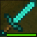
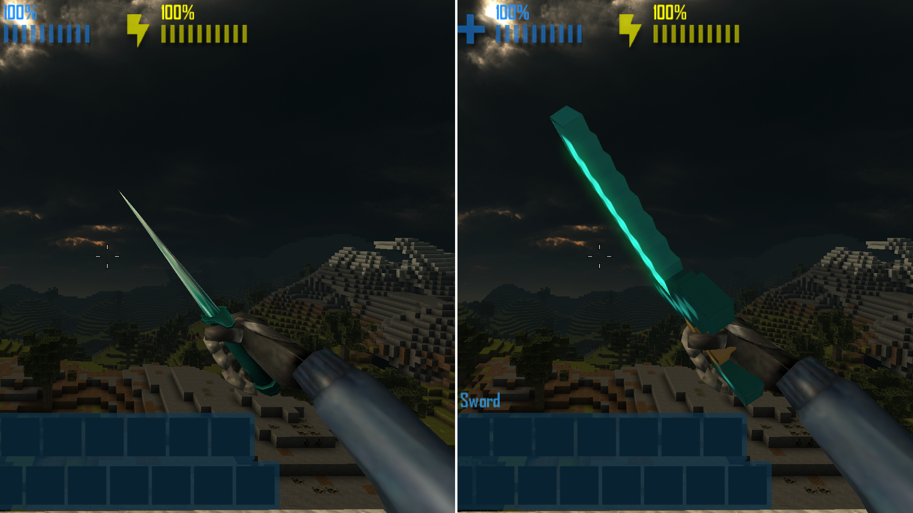

# CastleForge Minecraft Diamond Sword Addon


> A Minecraft-inspired melee weapon pack for CastleForge **WeaponAddons** that swaps in a custom diamond sword model and icon.

---

## Overview

**CastleForge Minecraft Diamond Sword Addon** is a community-made weapon pack for the CastleForge **WeaponAddons** framework.

This addon brings a Minecraft-style diamond sword into CastleMiner Z as a custom weapon pack using a `.clag` definition, custom model assets, and a custom icon.

The current pack is built as a **melee override** and is configured to use the **Knife** slot as its base behavior.

That means this release is best described as:

- a **visual and stat-themed melee replacement**
- a clean **WeaponAddons sample/community pack**
- a lightweight addon for players who want a recognizable Minecraft-inspired weapon in-game

---

## What this addon includes

This pack currently ships with:

- **1 weapon pack folder**: `MCDiamondSword`
- **1 `.clag` definition file**
- **1 custom icon**
- **1 custom compiled model**
- **3 supporting model texture `.xnb` files**

Current behavior/config highlights from the pack:

- **Weapon name:** `Diamond Sword`
- **Type:** `Melee`
- **Base slot:** `Knife`
- **As new item:** `false`
- **Custom icon:** enabled
- **Automatic fire:** `false`
- **Damage:** `12`
- **Self damage:** `0`
- **Inaccuracy:** `0`
- **Recoil:** `0`

---

## Important behavior note

This pack currently uses:

```ini
$AS_NEW_ITEM: false
$SLOT_ID: Knife
```

So this addon is **not currently configured as a separate synthetic item**.

Instead, it is set up to **override the Knife slot behavior/appearance** through WeaponAddons.

That is perfectly valid, but it is worth calling out clearly in the README so users know what to expect.

If you later want this to behave as a fully separate item instead of replacing a base slot, you can rework the pack around a new synthetic item setup.

---

## Why this addon stands out

- **Minecraft-inspired weapon theme** — instantly recognizable style
- **Uses the CastleForge WeaponAddons framework** — no separate compiled gameplay mod needed just for one weapon pack
- **Custom model + icon included** — not just a renamed vanilla item
- **Simple install footprint** — easy to test and easy to share

---

## Installation

### Requirements

You need the CastleForge **WeaponAddons** mod installed and working in your normal CastleForge setup.

### Install steps

1. Install CastleForge and the **WeaponAddons** mod.
2. Download this repository’s files or release archive.
3. Place the included **`MCDiamondSword`** folder into:

```text
!Mods\WeaponAddons\Packs\
```

So the final layout should look like:

```text
!Mods\WeaponAddons\Packs\MCDiamondSword\
```

4. Launch CastleMiner Z.
5. Let WeaponAddons scan and load the pack.
6. Spawn, equip, or otherwise access the overridden melee weapon in your testing workflow.

---

## Pack structure

```text
MCDiamondSword/
├─ diamondsword.clag
├─ icon.png
├─ models/
│  ├─ diamondsword.xnb
│  ├─ texture0_0.xnb
│  ├─ texture1_0.xnb
│  └─ texture2_0.xnb
└─ sounds/
```

### File notes

#### `diamondsword.clag`
Defines the weapon metadata and behavior.

#### `icon.png`
Provides the inventory/UI icon override.

#### `models/`
Contains the compiled `.xnb` model and its texture assets.

#### `sounds/`
Reserved for future custom swing/hit/audio additions if you decide to extend the pack later.

---

## Visual highlights

| Preview | What it demonstrates |
|---------------------------------------------------------|------------------------------------------------------------------------------------------------|
|                      | **Main addon preview** — the Minecraft-inspired sword showcased in-game.                       |
|    | **Icon visibility** — show how the custom icon looks in inventory or hotbar UI.                |
|  | **Before/after comparison** — compare the vanilla knife slot against the pack-enabled version. |

---

## Good screenshots to add

To make this page feel much stronger on GitHub, I would add:

1. **A held-weapon screenshot** in bright daylight
2. **An inventory/hotbar screenshot** showing the custom icon
3. **A close-up glamour shot** of the sword model
4. **A vanilla comparison screenshot** so users understand what changed

---

## Suggested future improvements

If you want to evolve this addon later, good next steps would be:

- switch to **`AS_NEW_ITEM: true`** if you want it to exist as its own item instead of a slot override
- add custom **swing / hit / equip** sounds
- add a custom crafting recipe
- create more Minecraft-themed weapons so this becomes a larger addon pack series

---

## Credits

### Pack concept and assembly
- **RussDev7**

### Framework used
- **CastleForge WeaponAddons**

---

## License

This project is open source and licensed under the **GPL-3.0**.

See the repository [LICENSE](LICENSE) file for full details.
